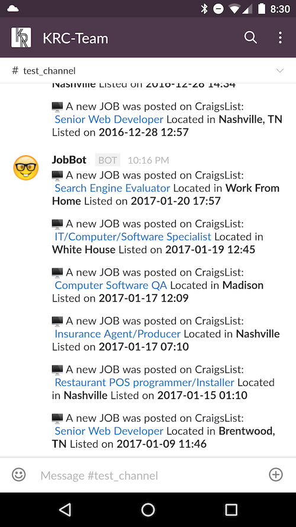
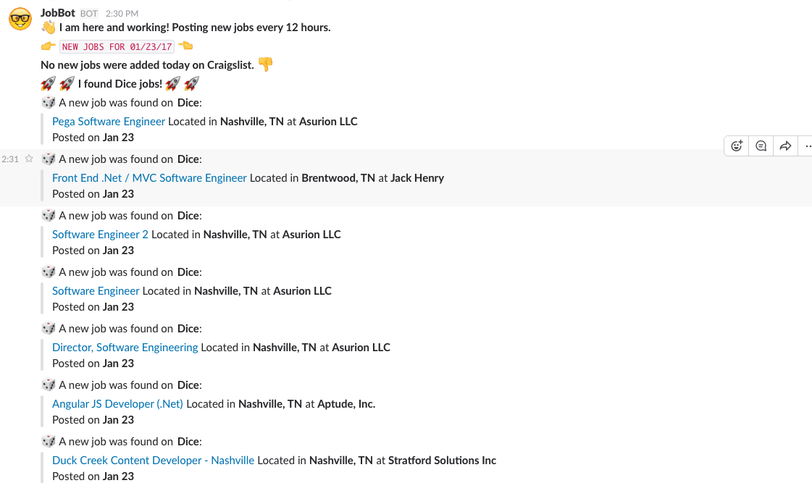

# Craigslist Slack JobBot

A very simple Slack Bot that checks for new developer postings in Nashville every 12 hours. It will post a message with the new jobs found or a message informing the channel that no jobs were found.

## First Run
When the bot first run it will send a welcome message and run the first check

  <kbd>
    
  </kbd>

## Jobs Found

When the bot does find jobs it list all of the new ones discovered

  <kbd>
    
  </kbd>

It will also search Dice for potential jobs (set to filter out recruiting positions) and post them daily

  <kbd>
    
  </kbd>

 The main source code (and many thanks!) can be found here: https://github.com/juliomalegria/python-craigslist
